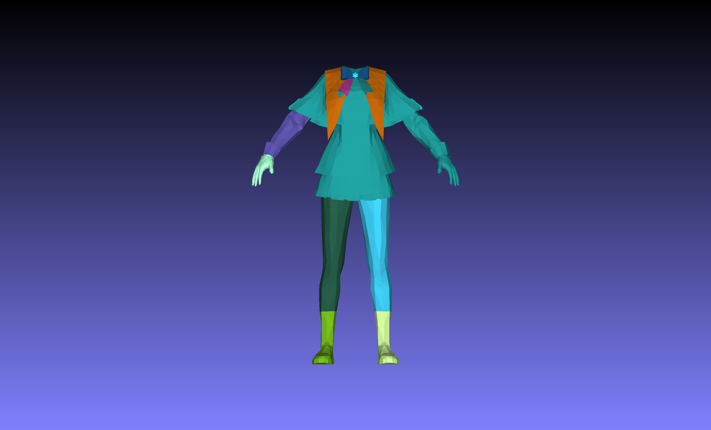

# Usage

```bash
python mesh_samesh.py --filename data/mesh_face.ply --mode component --visualize --sam_mesh.repartition_iterations 0 --sam_mesh.smoothing_iterations 32
```



# Pipeline


## Installation

To install SAMesh, use the following commands:

```bash
pip install -e .
```

Don't forget to init the submodules and pip install -e on them respectively. We tested SAMesh on python 3.12 and cuda 11.8. If you encounter issues with building SAM2, try with the `--no-build-isolation` flag. If you pyrenderer issues related to ctypes, try installing `PyOpenGL==3.1.7`.

# Parameter Reference

### `sam.engine_config`
| Parameter                  | Type                   | Description                                                                                                                                                                                                                                                                                                                                               |
| -------------------------- | ---------------------- | --------------------------------------------------------------------------------------------------------------------------------------------------------------------------------------------------------------------------------------------------------------------------------------------------------------------------------------------------------- |
| **points_per_side**        | integer (default *32*) | **Controls the density of the automatic sampling grid.** A value of 32 places 32 sample points along each side of the image, producing a total of 32 × 32 = 1024 points. Reducing this value speeds up processing but increases the risk of missing small objects.                                                                                        |
| **crop_n_layers**          | integer (default *0*)  | **Number of layers used for multi-scale segmentation.** A value of 0 disables multi-scale processing and runs the model only once on the original image, achieving the highest speed. Increasing this value enables segmentation on multiple cropped and zoomed scales, improving small-object detection at the cost of significantly higher computation. |
| **pred_iou_thresh**        | float (default *0.5*)  | **Threshold for predicted mask quality.** The model generates several candidate masks per point; this parameter filters them based on predicted IoU (mask–object overlap). Lowering the threshold keeps more low-quality candidates, potentially increasing recall but also noise.                                                                        |
| **stability_score_thresh** | float (default *0.7*)  | **Threshold for mask stability.** The model checks how stable each mask remains under small perturbations. Lowering this value retains masks with less stable boundaries, which may introduce rough or noisy edges.                                                                                                                                       |
| **stability_score_offset** | float (default *1.0*)  | **Offset used in stability score computation.** Typically does not require adjustment for standard use cases.                                                                                                                                                                                                                                             |


# `sam_mesh`

| Parameter                              |  Type |    Default | Description                                                                                                                                                                   |
| -------------------------------------- | ----: | ---------: | ----------------------------------------------------------------------------------------------------------------------------------------------------------------------------- |
| `min_area`                             |   int |       1024 | Pixel-area threshold used to remove small artifacts from binary masks. Connected components (either islands or holes) smaller than this are removed.                          |
| `face2label_threshold`                 |   int |         16 | Minimum number of occurrences a face ID must have inside a label region before that face–label association is considered valid.                                               |
| `connections_threshold`                |   int |         32 | Minimum number of shared-face observations required for a connection between two labels (from different views) to be kept in the match graph.                                 |
| `counter_lens_threshold_min`           |   int |         16 | Lower bound on the number of connections considered before treating a label as “overly connected.” Used together with a percentile-based threshold to enforce graph sparsity. |
| `connections_bin_resolution`           |   int | (see text) | Number of histogram bins used to model the distribution of connection-strength ratios (controls histogram granularity).                                                       |
| `connections_bin_threshold_percentage` | float |      0.125 | Fraction of the histogram’s total area used to choose an adaptive cutoff bin; connections below the corresponding ratio are discarded.                                        |
| `smoothing_threshold_percentage_size`  | float |      0.125 | Fractional size threshold for removing small connected components (based on face count) relative to the largest component.                                                    |
| `smoothing_threshold_percentage_area`  | float |      0.125 | Fractional area threshold for removing small connected components (based on surface area) relative to the largest component.                                                  |
| `smoothing_iterations`                 |   int |         64 | Number of smoothing passes. In each pass, unlabeled faces adopt the most common label among their labeled neighbors.                                                          |
| `repartition_lambda`                   | float |          6 | Weight (λ) balancing data cost vs. smoothness cost in the graph-cut energy: `TotalCost = DataCost + λ * SmoothnessCost`. Higher λ favors smoother, more contiguous segments.  |
| `repartition_iterations`               |   int |          1 | Number of alpha-expansion cycles performed by the graph-cut optimizer. More iterations may refine the partition at increased compute cost.                                    |

---

## `min_area`

**Purpose**
Filters small connected components from binary masks to remove noise while preserving meaningful detail.

**How it works**
Connected-component analysis (CCA) finds regions in the mask and computes their pixel area. Components with area `< min_area` are removed.

**Mode-specific behavior**

* `islands` mode: small isolated foreground islands are deleted (set to background).
* `holes` mode: small background holes enclosed by foreground are filled.

**Tuning tip**
Default `1024` is a reasonable starting point. Increase to be more aggressive against noise; decrease to preserve finer features. Choose based on image resolution and object scale.

---

## `face2label_threshold`

**Purpose**
Prevents spurious or unreliable face–label associations by requiring a face ID to appear a minimum number of times inside a label region before being accepted.

**How it works**
For each label region and view, the algorithm counts face IDs (e.g., via `np.bincount`). Face IDs with counts `> face2label_threshold` are kept as valid associations.

**Tuning tip**

* Raise (→ e.g., 20–25) to increase precision (fewer false associations).
* Lower (→ e.g., 8–10) to improve recall at the risk of more noise.
  Default `16` balances precision and recall for typical rendering/view setups.

---

## `connections_threshold`

**Purpose**
Filters pairwise label connections across views by requiring a minimum number of shared-face observations.

**How it works**
When a face is observed in two views and mapped to labels `(label1, label2)`, the counter for that label pair increments. Only pairs with counts `> connections_threshold` are kept.

**Tuning tip**

* Increase for a sparser, higher-confidence match graph (e.g., 40–50).
* Decrease to accept more, potentially weaker, connections (e.g., 10–20).
  Default `32` is a moderate requirement for robustness.

---

## `counter_lens_threshold_min`

**Purpose**
Enforces a baseline sparsity for label connectivity by preventing the dynamic percentile threshold from becoming too small.

**How it works**
Compute the 95th percentile of per-label connection counts and then take `max(95th_percentile, counter_lens_threshold_min)` as the effective outlier cutoff. Labels with connection counts above this cutoff are considered “overly connected” and are removed from ratio computations.

**Tuning tip**

* Increase to be stricter about removing high-degree labels (more sparsity).
* Decrease to allow more connected labels to remain.
  Default `16` establishes a conservative floor.

---

## `connections_bin_resolution` & `connections_bin_threshold_percentage`

**Purpose**
Implement an adaptive, data-driven threshold to filter connections based on their normalized strength.

**How it works**

1. Build a histogram of connection-strength ratios using `connections_bin_resolution` bins.
2. Starting from the weakest bin, accumulate counts until the cumulative count exceeds `connections_bin_threshold_percentage * total_count`. The bin where this occurs determines the connection-ratio cutoff; connections weaker than that cutoff are discarded.

**Tuning tips**

* `connections_bin_resolution`: higher values give a more detailed histogram (more sensitive), lower values give coarser, more robust binning.
* `connections_bin_threshold_percentage`: larger fractions keep fewer connections (stricter); smaller fractions keep more (lenient).
  Default percentage `0.125` (12.5%) is a moderate choice that adapts to the dataset.

---

## `smoothing_threshold_percentage_size`, `smoothing_threshold_percentage_area`, and `smoothing_iterations`

**Purpose**
Two-stage cleanup: (1) remove small noisy components; (2) propagate labels into unlabeled faces to fill gaps and smooth boundaries.

**How it works**

1. **Cleaning** — Identify connected face components per label and compute each component’s face count and surface area. A component is removed only if it is smaller than both thresholds (size fraction *and* area fraction relative to the largest component). This dual condition reduces chances of removing valid small-but-dense or sparse-but-large components.
2. **Smoothing** — For `smoothing_iterations` passes, each unlabeled face is assigned the most common label among its adjacent faces. Each pass propagates labels one face-layer outward.

**Tuning tips**

* Increase the fractional thresholds for more aggressive removal of tiny fragments.
* Increase `smoothing_iterations` to fill larger gaps; reduce to avoid label bleeding.
  Defaults (`0.125` for thresholds, `64` iterations) are conservative for strong gap-filling; lower iterations are common for high-resolution meshes.

---

## `repartition_lambda` and `repartition_iterations`

**Context**
Used when `target_labels` is `None` and the method performs energy minimization to refine the partition.

**Energy formulation**
`TotalCost = DataCost + λ * SmoothnessCost`

* **DataCost:** how consistent a face’s label is with the initial assignment (from `cost_data`).
* **SmoothnessCost:** penalty based on adjacency (dihedral angles); larger dihedral angles allow label changes more cheaply.

**Parameters**

* `repartition_lambda` (λ): controls the trade-off between fidelity to initial labels and smooth, contiguous segments. Higher λ → smoother partitions; lower λ → more fidelity to data.
* `repartition_iterations`: number of alpha-expansion cycles. Each cycle iterates through labels and solves a binary graph-cut to decide which faces adopt the current label. More iterations allow better convergence to a lower-energy solution but cost more compute.

**Tuning tips**

* If segmentation is too noisy → increase `repartition_lambda`.
* If segmentation is oversmoothed (loses detail) → decrease `repartition_lambda`.
* Typical `repartition_iterations` range: 3–8 for most cases; defaults of `1` or a few iterations may suffice if compute is constrained.

# `renderer`
| Parameter                      | Default        | Description                                                                                                                                                                                                                                       |
| ------------------------------ | -------------- | ------------------------------------------------------------------------------------------------------------------------------------------------------------------------------------------------------------------------------------------------- |
| **`target_dim`**               | `[1024, 1024]` | Output resolution of the rendered images.                                                                                                                                                                                                         |
| **`camera_generation_method`** | —              | Method used to sample camera viewpoints. Valid options: `tetrahedron`, `octohedron`, `cube`, `icosahedron`, `dodecahedron`, `standard`, `swirl`, `sphere`.                                                                                        |
| **`sampling_args`**            | —              | Arguments used by the camera sampling method. <br>• All methods require `radius`. <br>• `sphere`: requires `n` (number of samples). <br>• `standard`: optional `n` and `elevation`. <br>• `swirl`: optional `n`, `cycles`, and `elevation_range`. |
| **`lighting_args`**            | `{}`           | Optional lighting configuration (empty by default).                                                                                                                                                                                               |

## `renderer.renderer_args`
| Parameter               | Default | Description                                                             |
| ----------------------- | ------- | ----------------------------------------------------------------------- |
| **`uv_map`**            | `True`  | Enables texture sampling using UV coordinates.                          |
| **`interpolate_norms`** | `True`  | Enables normal interpolation across triangle surfaces (smooth shading). |


